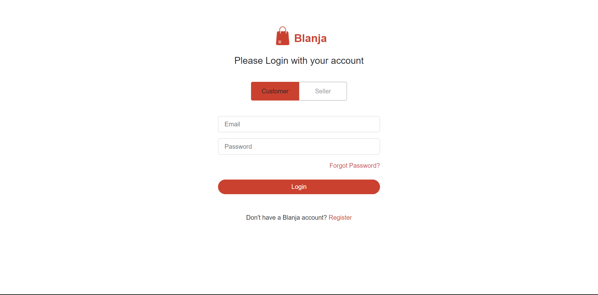
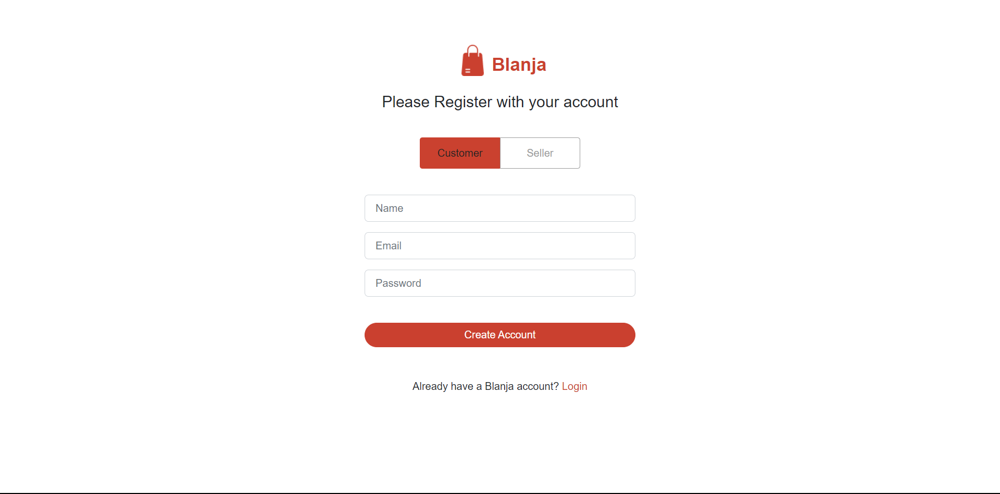

<p align="center">
<div align="center">
  
</div>
  <h3 align="center">Blanja App</h3>
  <p align="center">
    <a href="https://github.com/RezaldhoArmadhani/Blanja-FE"><strong>Explore the docs »</strong></a>
    <br />
    <a href="https://blanja-fe-eight.vercel.app/">View Demo</a>
    <br />
    <a href="https://blanja-be-production.up.railway.app">API Demo</a>
  </p>
</p>

<!-- TABLE OF CONTENTS -->

## Table of Contents

- [Table of Contents](#table-of-contents)
- [About The Project](#about-the-project)
  - [Built With](#built-with)
- [Getting Started](#getting-started)
  - [Prerequisites](#prerequisites)
  - [Installation](#installation)
  - [Setup .env](#setup-env)
- [Screenshots](#screenshots)
- [Contributing](#contributing)
- [Related Project](#related-project)
- [Contact](#contact)

<!-- ABOUT THE PROJECT -->

## About The Project

Blanja adalah proyek website E-commerce yang bertujuan untuk memberikan pengalaman belanja online yang mudah dan nyaman bagi pengguna di Indonesia. Situs ini menawarkan berbagai macam produk, termasuk fashion, kecantikan, elektronik, serta makanan dan minuman.

Untuk menggunakan layanan Blanja, pengguna hanya perlu membuat akun dan memasukkan detail pembayaran. Setelah itu, pengguna dapat menelusuri produk, menambahkannya ke keranjang belanja, dan memilih metode pembayaran yang diinginkan.

Dengan segala fitur dan keamanan yang diberikan, Blanja diharapkan dapat memberikan pengalaman belanja online yang aman, mudah, dan nyaman bagi pengguna di seluruh Indonesia.

<!-- GETTING STARTED -->

## Getting Started

### Prerequisites

This is an example of how to list things you need to use the software and how to install them.

- [nodejs](https://nodejs.org/en/download/)
- [Bootstrap Css](https://getbootstrap.com/)
- [React JS](https://reactjs.org/)
- [Redux](https://redux.js.org/)

### Installation

- Clone This Front End Repo

```
git clone https://github.com/RezaldhoArmadhani/Blanja-FE
```

- Go To Folder Repo

```
cd ui
```

- Install Module

```
npm install
```

- <a href="#setup-env">Setup .env</a>
- Type ` npm run start` To Start Website

### Setup .env

Create .env file in your root project folder.

```
REACT_APP_ENDPOINT = [BACKEND_URL]
```

<!-- ROADMAP -->

## Screenshots

<table>
 <tr>
    <td></td>
    <td> </td>
  </tr>
   <tr>
    <td>Login</td>
    <td>Register</td>
  </tr>

  <tr>
    <td> </td>
     <td></td>
  </tr>
   <tr>
    <td>Landing</td>
    <td>Detail</td>
  </tr>
  <tr>
    <td> </td>
    <td></td>
  </tr>
   <tr>
    <td>Profile Seller</td>
    <td>Profile Customer</td>
  </tr>
   <tr>
    <td> </td>
    <td></td>
  </tr>
   <tr>
    <td>My Bag</td>
    <td>Add Product</td>
  </tr>
   <tr>
     <td></td>
      <td></td>
  </tr>
   <tr>
    <td>Update Product</td>
     <td>Delete Product</td>
  </tr>
</table>
<!-- CONTRIBUTING -->

## Contributing

Contributions are what make the open source community such an amazing place to be learn, inspire, and create. Any contributions you make are **greatly appreciated**.

1. Fork the Project
2. Create your Feature Branch (`git checkout -b feature/AmazingFeature`)
3. Commit your Changes (`git commit -m 'Add some AmazingFeature'`)
4. Push to the Branch (`git push origin feature/AmazingFeature`)
5. Open a Pull Request

## Related Project

:rocket: [`Backend Blanja`](https://github.com/RezaldhoArmadhani/Blanja-BE)

:rocket: [`Frontend Blanja`](https://github.com/RezaldhoArmadhani/Blanja-FE)

:rocket: [`Demo Blanja`](https://blanja-fe-eight.vercel.app/)

Project Link: [https://github.com/RezaldhoArmadhani/Blanja-FE](https://github.com/RezaldhoArmadhani/Blanja-FE)
